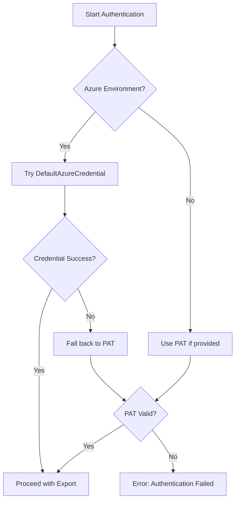
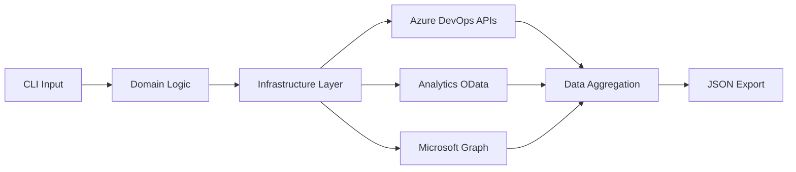

# Technical Architecture

## Overview

The azdo-process-export tool follows "Screaming Architecture" principles, where business concepts (Process, Metrics) are front-and-center, not frameworks. This approach echoes Uncle Bob's architectural philosophy of making the purpose of the system obvious from the structure.

## Folder Layout (Screaming Architecture)

```
azdo_process_export/
├── domain/          # Business logic: project_process.py, metrics.py
├── infrastructure/  # External APIs: azure_devops_rest.py, analytics_odata.py
├── cli/            # Click command facade
├── tests/          # Behave BDD features & steps
└── scripts/        # Sample notebooks and utilities
```

This structure keeps business concepts (Process, Metrics) prominent, separating them from technical concerns like frameworks and external service integrations.

## Dependencies & Execution

### PEP 723 Inline Dependencies

The `__main__.py` contains inline script metadata for easy execution:

```python
# /// script
# requires-python = ">=3.11"
# dependencies = [
#   "azure-devops>=7.0.0",
#   "azure-identity>=1.16.0",
#   "msgraph-core>=1.0.0",
#   "click>=8.1.0",
#   "orjson>=3.9.0",
#   "rich>=13.0.0",
#   "httpx>=0.24.0",
# ]
# ///
```

Running `uv run __main__.py` will auto-bootstrap environments and dependencies.

### Development Dependencies

For development tooling (testing, linting, type checking), dependencies are managed via `pyproject.toml`:

```toml
[dependency-groups]
dev = [
    "behave>=1.2.6",
    "pytest>=7.2.0",
    "pytest-asyncio>=0.21.0",
    "pre-commit>=2.20.0",
    "deptry>=0.23.0",
    "mypy>=0.991",
    "pytest-cov>=4.0.0",
    "ruff>=0.11.5",
]
```

## Core Components

### Domain Layer

**Purpose**: Contains business logic and domain models independent of external concerns.

Key files:
- `project_process.py` - Core domain model for Azure DevOps project processes
- `metrics.py` - Activity metrics and analytics domain logic
- `models.py` - Data transfer objects and domain entities

### Infrastructure Layer

**Purpose**: Handles integration with external services and APIs.

Key files:
- `azure_devops_rest.py` - Azure DevOps REST API client
- `analytics_odata.py` - OData Analytics API integration
- `graph_client.py` - Microsoft Graph API for user enrichment
- `auth.py` - Authentication handling (DefaultAzureCredential + PAT fallback)

### CLI Layer

**Purpose**: Command-line interface built on Click for user interaction.

Key files:
- `main.py` - Primary Click command definitions
- `commands.py` - Individual command implementations
- `formatters.py` - Output formatting and rich console integration

## Authentication Strategy



### Credential Chain Priority

1. **DefaultAzureCredential** (Azure environments)
   - Managed Identity
   - Azure CLI credentials
   - Visual Studio credentials
   - Environment variables

2. **Personal Access Token** (fallback/local development)
   - Provided via `--pat` flag
   - Environment variable `AZDO_PAT`

## Data Flow Architecture



### Processing Pipeline

1. **Input Validation** - Validate project name and authentication
2. **Parallel Data Fetching** - Concurrent API calls with asyncio (max 10 concurrent)
3. **Data Enrichment** - Enhance users with Microsoft Graph data
4. **Aggregation** - Combine all data into unified domain model
5. **Serialization** - Export to JSON using orjson for performance

## Error Handling Strategy

### Resilience Patterns

- **Exponential Backoff** for transient failures (429, 503)
- **Circuit Breaker** for Analytics endpoint failures
- **Graceful Degradation** for non-critical data (warnings vs errors)

### Error Classification

| Error Type | Behavior | Exit Code |
|------------|----------|-----------|
| Analytics Unavailable | Fatal error with clear message | 2 |
| Authentication Failure | Suggest alternative auth methods | 1 |
| Partial Data Failure | Continue with warnings in output | 1 |
| Network Timeout | Retry with exponential backoff | 0 or 1 |

## Performance Considerations

### Concurrency Model

- **asyncio** for I/O-bound operations
- **Maximum 10 concurrent requests** to respect API limits
- **Connection pooling** via httpx for efficient HTTP handling

### Memory Management

- **Streaming JSON parsing** for large responses
- **Lazy loading** of optional data (user enrichment)
- **Garbage collection hints** for large data structures

### Target Performance

- **≤5 minutes** for projects with 50k work items
- **≤50 MB** output file size for 95% of projects
- **≤90% success rate** with DefaultAzureCredential

## Logging & Observability

### Structured Logging

Following Better Stack guidance:
- **JSON format** for machine readability
- **No root logger** to avoid conflicts
- **Trace level** available for debugging
- **Contextual information** (request IDs, timing)

### Log Levels

- `INFO` - Normal operation progress
- `DEBUG` - Detailed execution information  
- `TRACE` - Verbose API request/response details
- `WARNING` - Non-fatal issues (partial data)
- `ERROR` - Fatal errors requiring user action

## Testing Architecture

### Behavior-Driven Development (BDD)

- **Gherkin scenarios** in `tests/features/`
- **Step definitions** in `tests/steps/`
- **Ephemeral test environment** with Azure DevOps demo org

### Test Categories

1. **Authentication Tests** - Credential chain validation
2. **API Integration Tests** - Real API interaction scenarios  
3. **Data Export Tests** - End-to-end export validation
4. **Error Handling Tests** - Failure scenario coverage
5. **Performance Tests** - Runtime and memory benchmarks

## Security Considerations

### Credential Management

- **No credential storage** - always provided at runtime
- **Minimal PAT scopes** - only required permissions
- **Secure credential passing** - environment variables preferred

### Data Privacy

- **No PII logging** - sanitized logs only
- **Temporary credential lifetime** - automatic cleanup
- **No data persistence** - export only to specified output file